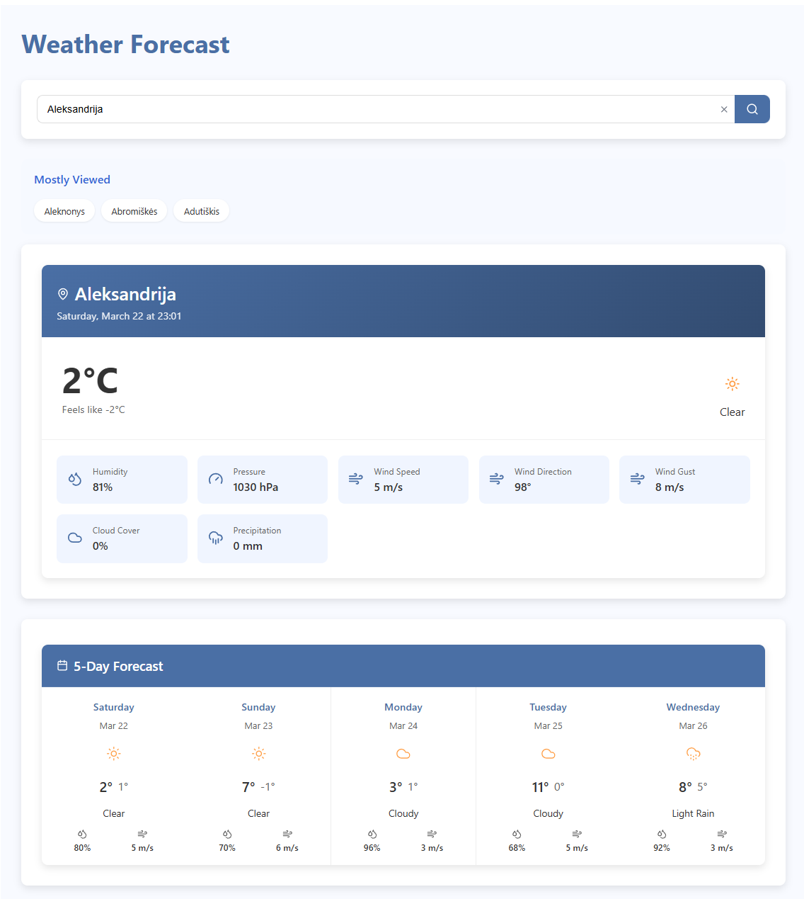

# Lithuanian Weather App

A comprehensive weather application that provides up-to-date forecasts for cities in Lithuania and some neighboring regions using the [api.meteo.lt](https://api.meteo.lt) API.



## Features

- **Real-time Weather Data**: Get current weather conditions for Lithuanian cities and some border regions
- **5-Day Forecast**: View detailed forecasts for the upcoming five days
- **City Search**: Easily find cities with an intuitive search feature
- **Most Viewed Cities**: Track and display the most frequently viewed cities
- **Responsive Design**: Works on desktop and mobile devices

## Table of Contents

- [Technologies Used](#technologies-used)
- [Project Structure](#project-structure)
- [Installation](#installation)
- [Usage](#usage)
- [API Endpoints](#api-endpoints)
- [Components](#components)
- [Configuration](#configuration)
- [Contributing](#contributing)
- [License](#license)

## Technologies Used

### Frontend

- React + TypeScript
- Vite
- React Query for data fetching
- SCSS Modules for styling
- LocalStorage for saving user preferences

### Backend

- Node.js
- Express
- TypeScript

## Project Structure

```
IBM_WEATHER_APP/
├── README.md
├── backend/                # Backend server code
│   ├── .gitignore
│   ├── .prettierrc
│   ├── index.ts            # Main server file (API proxy)
│   ├── package.json
│   ├── package-lock.json
│   ├── tsconfig.json
│   └── node_modules/
│
├── frontend/               # Frontend React application
│   ├── .gitignore
│   ├── eslint.config.js
│   ├── index.html
│   ├── package.json
│   ├── package-lock.json
│   ├── tsconfig.app.json
│   ├── tsconfig.json
│   ├── tsconfig.node.json
│   ├── vite.config.ts
│   ├── node_modules/
│   ├── public/
│   └── src/                # Source code
│       ├── .prettierrc
│       ├── App.module.scss
│       ├── App.tsx         # Main App component
│       ├── index.css
│       ├── main.tsx
│       ├── vite-env.d.ts
│       ├── assets/
│       │   └── loadingAnimation.tsx  # Reusable loading spinner
│       ├── pages/          # Main components
│       │   ├── DisplayCityWeather.module.scss
│       │   ├── DisplayCityWeather.tsx
│       │   ├── DisplayFiveDayForecast.module.scss
│       │   ├── DisplayFiveDayForecast.tsx
│       │   ├── MostViewedCities.module.scss
│       │   ├── MostViewedCities.tsx
│       │   ├── SearchCities.module.scss
│       │   └── SearchCities.tsx
│       └── services/       # API and utility services
│           ├── axios.ts
│           ├── HTTPRequests.ts
│           └── interfaces.ts
```

## Installation

### Prerequisites

- Node.js (v14 or higher)
- npm or yarn

### Setup

1. Clone the repository:

```bash
git clone https://github.com/yourusername/IBM_WEATHER_APP.git
cd IBM_WEATHER_APP
```

2. Install backend dependencies:

```bash
cd backend
npm install
```

3. Install frontend dependencies:

```bash
cd frontend
npm install
```

## Usage

### Running the Application Locally

1. Start the backend server:

```bash
cd ..
cd backend
npm run dev
```

2. In a separate terminal, start the frontend:

```bash
cd frontend
npm run dev
```

3. Open your browser and navigate to: `http://localhost:5173`

## API Endpoints

The backend serves as a proxy to overcome CORS limitations with the external API and provides the following endpoints:

### `/places`

- **Method**: GET
- **Description**: Retrieves all available cities and regions with their codes
- **Response**: JSON list of places with city codes

### `/cityForecast`

- **Method**: POST
- **Description**: Fetches detailed weather forecast for a specific city
- **Request Body**: `{ cityCode: string }`
- **Response**: JSON containing detailed forecast data

### `/cityName`

- **Method**: POST
- **Description**: Logs the date and name of the city clicked by the user
- **Request Body**: City name and timestamp information

## Components

### `DisplayCityWeather`

Displays the current weather conditions and time for the selected city.

### `DisplayFiveDayForecast`

Shows a detailed 5-day forecast including:

- Daily high and low temperatures
- Weather conditions (rain, sunny, cloudy, etc.)
- Average humidity and wind speed

### `MostViewedCities`

Tracks and displays the top 3 most frequently viewed cities, saved in localStorage.

### `SearchCities`

Provides a search interface to find cities:

- Filters results as you type
- Displays city names with their administrative divisions to avoid confusion with duplicates
- Tracks popular searches

### `LoadingAnimation`

A reusable loading spinner component with customizable color and size.

## Configuration

### Prettier Configuration

The project uses Prettier for code formatting. Configuration can be found in `.prettierrc` files in both frontend and backend directories.

### TypeScript Configuration

TypeScript is configured in `tsconfig.json` files in respective directories.

## Extending the Application

### Adding More Days to the Forecast

To display more than 5 days of forecast data, modify the slice parameter in the `DisplayFiveDayForecast.tsx` component:

```typescript
// Change from:
.slice(0, 5);
// To (for example, 7 days):
.slice(0, 7);
```

### Showing More Popular Cities

To display more than 3 cities in the most viewed list, modify the slice parameter in the `MostViewedCities.tsx` component:

```typescript
// Change from:
const topCities = citiesArray.slice(0, 3);
// To (for example, 5 cities):
const topCities = citiesArray.slice(0, 5);
```

## License

Copyright (c) 2025 IBM_WEATHER_APP
Released under the MIT License. Users are free to use, modify, and distribute this software, subject to including the original copyright notice in any substantial copies of the software.

## Acknowledgements

- [api.meteo.lt](https://api.meteo.lt) for providing the weather forecast data
- Icons from Lucide react
